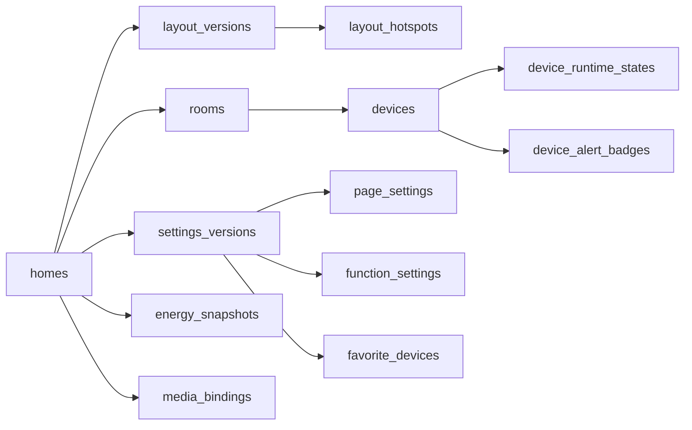
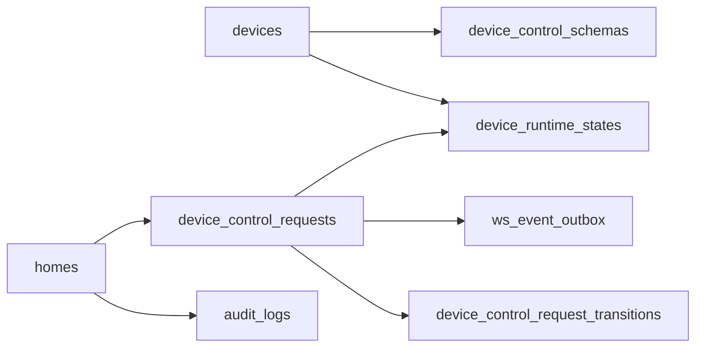
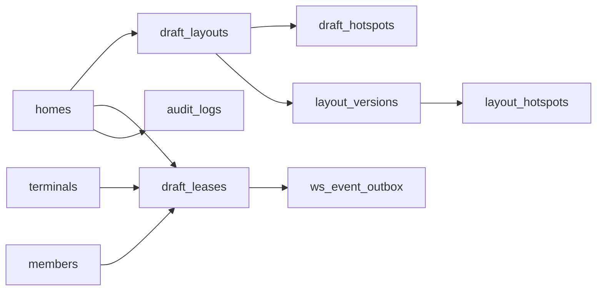

# 《家庭智能中控 Web App 数据库 ER 图与关系说明 v2.4》

## 一、文档信息

- 文档名称：家庭智能中控 Web App 数据库 ER 图与关系说明 v2.4
- 文档类型：工程设计配套文档 / 数据库关系实施说明
- 适用对象：后端、前端联调、测试、运维、Codex 任务拆解
- 编制日期：2026-04-14
- 版本状态：已冻结（实施版）
- 基线文档：
  - 《家庭智能中控 Web App PRD v2.4》
  - 《家庭智能中控 Web App 接口清单 v2.4》
  - 《家庭智能中控 Web App 统一响应体与错误体规范 v2.4》
  - 《家庭智能中控 Web App 数据库模型初稿 v2.4》

---

## 二、文档目标

本文件用于把《数据库模型初稿 v2.4》中的表结构，进一步翻译成“关系图 + 关系规则 + 关键约束说明”，便于后续完成以下工作：

1. PostgreSQL 首版 DDL 设计。
2. 后端 module / service / repository 分层。
3. Save All、Publish、控制幂等、编辑锁、多端同步等核心链路的库表联动实现。
4. 前后端联调时对 `settings_version`、`layout_version`、`request_id`、`lease_id`、`backup_restore_completed` 等关键对象的统一理解。

本文件不替代正式 DDL，也不定义 ORM 细节；它只解决“表之间怎么关联、为什么这样关联、哪些地方不能做错”。

---

## 三、关系总图（按领域分层）

```mermaid
erDiagram
    HOMES ||--o{ MEMBERS : has
    HOMES ||--o{ TERMINALS : has
    HOMES ||--o{ PIN_SESSIONS : has
    HOMES ||--o{ PIN_LOCK_RECORDS : has
    HOMES ||--o{ ROOMS : has
    HOMES ||--o{ DEVICES : has
    HOMES ||--o{ HA_ENTITIES : syncs
    HOMES ||--o{ PAGE_ASSETS : owns
    HOMES ||--o{ LAYOUT_VERSIONS : publishes
    HOMES ||--o{ SETTINGS_VERSIONS : saves
    HOMES ||--o{ DRAFT_LAYOUTS : edits
    HOMES ||--o{ DRAFT_LEASES : locks
    HOMES ||--o{ DEVICE_CONTROL_REQUESTS : issues
    HOMES ||--o{ ENERGY_ACCOUNTS : binds
    HOMES ||--o{ ENERGY_SNAPSHOTS : records
    HOMES ||--o{ MEDIA_BINDINGS : binds
    HOMES ||--o{ SYSTEM_CONNECTIONS : configures
    HOMES ||--o{ SYSTEM_BACKUPS : creates
    HOMES ||--o{ AUDIT_LOGS : writes
    HOMES ||--o{ WS_EVENT_OUTBOX : emits
    HOMES ||--o{ HA_SYNC_STATUS : tracks

    ROOMS ||--o{ DEVICES : contains

    DEVICES ||--o{ DEVICE_ENTITY_LINKS : maps
    HA_ENTITIES ||--o{ DEVICE_ENTITY_LINKS : linked_by

    DEVICES ||--o{ DEVICE_RUNTIME_STATES : has
    DEVICES ||--o{ DEVICE_ALERT_BADGES : has
    DEVICES ||--o{ DEVICE_CONTROL_SCHEMAS : has

    PAGE_ASSETS ||--o{ LAYOUT_VERSIONS : used_by
    LAYOUT_VERSIONS ||--o{ LAYOUT_HOTSPOTS : contains
    DEVICES ||--o{ LAYOUT_HOTSPOTS : binds

    SETTINGS_VERSIONS ||--o{ FAVORITE_DEVICES : snapshots
    SETTINGS_VERSIONS ||--o| PAGE_SETTINGS : snapshots
    SETTINGS_VERSIONS ||--o| FUNCTION_SETTINGS : snapshots
    DEVICES ||--o{ FAVORITE_DEVICES : selected

    PAGE_ASSETS ||--o{ DRAFT_LAYOUTS : used_by
    DRAFT_LAYOUTS ||--o{ DRAFT_HOTSPOTS : contains
    DEVICES ||--o{ DRAFT_HOTSPOTS : binds
    TERMINALS ||--o{ DRAFT_LAYOUTS : edits
    TERMINALS ||--o{ DRAFT_LEASES : holds
    MEMBERS ||--o{ DRAFT_LEASES : owns

    DEVICES ||--o{ DEVICE_CONTROL_REQUESTS : targets
    DEVICE_CONTROL_REQUESTS ||--o{ DEVICE_CONTROL_REQUEST_TRANSITIONS : transitions
    MEMBERS ||--o{ DEVICE_CONTROL_REQUESTS : initiated_by
    TERMINALS ||--o{ DEVICE_CONTROL_REQUESTS : from_terminal

    DEVICES ||--o{ MEDIA_BINDINGS : default_for
    MEMBERS ||--o{ SYSTEM_BACKUPS : created_by
```

---

## 四、核心主线关系图（按业务闭环）

### 4.1 首页正式展示主线

说明：

- 首页 `GET /api/v1/home/overview` 的聚合，不应从单一大表读取，而是从“正式布局 + 业务设备 + 当前运行态 + 当前生效设置版本 + 电量/媒体附加信息”聚合生成。
- `layout_version` 与 `settings_version` 必须彼此独立，首页同时消费两者。

### 4.2 控制闭环主线

说明：

- `POST /api/v1/device-controls` 的受理结果先落 `device_control_requests`。
- 最终状态推进、重试、TIMEOUT、STATE_MISMATCH 等进入 `device_control_request_transitions`。
- 控制相关 WebSocket 事件由 `ws_event_outbox` 或等价出站事件机制承载更稳。

### 4.3 编辑态闭环主线

说明：

- 草稿内容与锁状态必须拆表。
- Publish 的本质是“草稿转正式版本 + 释放锁 + 发全端同步事件”。
- Save All 不应写 `draft_layouts` / `layout_versions`；Publish 不应写 `settings_versions`。

---

## 五、按领域的关系说明

## 5.1 家庭、成员、终端、PIN 会话域

### 涉及表

- `homes`
- `members`
- `terminals`
- `home_auth_configs`
- `pin_sessions`
- `pin_lock_records`

### 关系规则

1. 一个 `home` 可以有多个 `members`、多个 `terminals`。
2. 当前产品虽然是固定家庭账号，但数据库层不应把成员与家庭写死为 1:1。
3. `pin_sessions` 应与 `home_id + terminal_id` 绑定，而不是全局单例；因为 PRD 明确 PIN 会话有效期按终端维度生效。
4. `pin_sessions` 如需记录本次验证对应的接口入参，应保存为可选 `verified_for_action` 审计字段，而不是把动作范围做成会话主键维度。
5. `pin_lock_records` 应支持按终端维度记录失败次数与锁定截止时间，避免墙板和桌面相互污染。

### 实施级约束

- `terminals.terminal_code` 唯一。
- `pin_sessions` 必须通过 `is_active` + partial unique index 实现 `(home_id, terminal_id)` 单终端单活跃会话。
- `pin_lock_records` 应对 `(home_id, terminal_id)` 维持单活跃锁记录。

---

## 5.2 房间、业务设备、HA 原始实体域

### 涉及表

- `rooms`
- `devices`
- `ha_entities`
- `device_entity_links`
- `device_runtime_states`
- `device_alert_badges`
- `device_control_schemas`

### 关系规则

1. `rooms 1:N devices`：一个房间可以包含多个业务设备。
2. `devices` 与 `ha_entities` 通过 `device_entity_links` 形成“一个业务设备可聚合多个 HA 实体、一个 HA 实体只能归属一个业务设备”的冻结映射关系。
3. `device_entity_links.entity_role` 是多实体聚合的关键，决定默认控制对象、遥测来源、状态来源、告警来源。
4. `device_runtime_states` 必须与 `devices` 拆表：
   - `devices` 放低频稳定字段，如展示名、能力、入口行为。
   - `device_runtime_states` 放高频字段，如 `aggregated_state`、`aggregated_mode`、`telemetry`、`last_state_update_at`。
5. `device_alert_badges` 与 `device_control_schemas` 必须独立成子表，避免把设备表做成超大 JSON 聚合表。

### 为什么要拆 `device_runtime_states`

因为首页、浮层、详情、WS 状态更新都会高频写运行态。如果直接把运行态写在 `devices` 主表，会导致：

1. 设备静态配置与动态状态频繁争抢同一行锁。
2. 设备列表页、映射修正、收藏编辑与 HA 状态流写冲突概率上升。
3. 更新 `updated_at` 时语义混乱，不利于定位“业务配置变了”还是“设备状态变了”。

### 实施级约束

- `devices.id` 为对外业务设备 ID。
- `ha_entities.entity_id` + `home_id` 唯一。
- `device_entity_links` 对 `(device_id, ha_entity_id)` 唯一。
- `device_entity_links.ha_entity_id` 必须加唯一约束，保证一个 HA 实体在 v2.4 只归属一个业务设备。
- `device_runtime_states.device_id` 唯一，表示一个设备当前只有一份最新运行态。

---

## 5.3 首页正式布局域

### 涉及表

- `page_assets`
- `layout_versions`
- `layout_hotspots`

### 关系规则

1. 一个家庭可以有多个 `layout_versions`，每次 Publish 生成一条正式版本。
2. 一个 `layout_version` 对应多个 `layout_hotspots`。
3. 一个热点只能绑定一个 `device_id`，这与 PRD 中“一个 Hotspot 只能绑定一个 device_id”的规则一致。
4. `page_assets` 与 `layout_versions` 为 1:N；底图替换不应直接覆盖历史正式版本的引用记录。

### 为什么正式布局必须版本化

因为 PRD 明确：

1. Publish 会生成新正式版本。
2. 未发布前只对当前编辑终端预览生效。
3. 发布成功后所有在线终端切换到新正式版本。
4. 恢复备份后也会生成新的正式版本。

因此数据库不能只有一张“当前首页布局表”，否则没有历史版本、无法恢复、无法审计、无法做 VERSION_CONFLICT。

### 实施级约束

- `layout_versions.layout_version` 在 `home_id` 内唯一。
- `layout_hotspots` 对 `(layout_version_id, hotspot_id)` 唯一。
- `layout_hotspots` 对 `(layout_version_id, device_id)` 建普通索引；如同一正式布局内不允许同一设备出现多个热点，可加唯一约束。
- `x`、`y` 字段必须加 CHECK，范围 `[0,1]`。

---

## 5.4 设置中心域

### 涉及表

- `settings_versions`
- `favorite_devices`
- `page_settings`
- `function_settings`

### 关系规则

1. 每次 Save All 成功都会生成一个新的 `settings_version`。
2. `favorite_devices`、`page_settings`、`function_settings` 都应归属于某个 `settings_version` 快照。
3. 当前生效的设置快照应该按版本读取，而不是把多张表当“单行当前配置”直接覆盖。
4. 如果担心读路径过重，可以额外维护当前生效版本指针，但底层仍应保留版本快照。

### 为什么 Save All 要走版本快照

因为 PRD 和接口冻结要求：

1. Save All 成功后要返回新的 `settings_version`。
2. 要通过 `settings_updated` 通知所有终端。
3. 备份恢复也需要带 `settings_version`。

如果不做版本快照，后面很难：

- 精确实现 VERSION_CONFLICT
- 恢复到某个历史点
- 解释某一时刻生效的 favorites / page / function 配置

### 实施级约束

- `settings_versions.settings_version` 在 `home_id` 内唯一。
- `page_settings` 与 `function_settings` 必须按 `settings_version_id` 1:1。
- `favorite_devices` 对 `(settings_version_id, device_id)` 唯一。
- `favorite_devices.favorite_order` 在同一个 `settings_version_id` 内应唯一。

---

## 5.5 系统连接、电量、默认媒体绑定域

### 涉及表

- `system_connections`
- `energy_accounts`
- `energy_snapshots`
- `media_bindings`

### 关系规则

1. `system_connections` 是家庭级连接配置，不应挂到某个成员或终端下面。
2. `energy_accounts` 是家庭级绑定；一个家庭当前只有一个生效电量绑定。
3. `energy_snapshots` 是时间序列快照；一个家庭会有多条刷新记录。
4. `media_bindings` 是家庭级唯一默认媒体绑定；当前只能指定一个默认媒体设备。
5. `GET /api/v1/system-connections` 返回的 `settings_version` 不来自 `system_connections` 表本身，而是由查询层补充当前生效 `settings_versions` 结果，作为设置中心上下文版本。

### `binding_status` 与 `availability_status` 为什么要拆开

冻结文档已经明确：默认媒体设备的“未绑定”和“已绑定但离线”是两个不同产品状态，因此：

- `binding_status` 解决“是否已指定默认媒体设备”。
- `availability_status` 解决“已绑定的设备现在是否在线可用”。
- `binding_status` 必须以 `media_bindings` 为真源。
- `availability_status` 必须优先由已绑定设备的 `device_runtime_states` 派生；若绑定表保留该字段，也只能视为聚合缓存或降级快照。

数据库层如果把这两个概念揉成一个字段，后端很快就会在首页音乐卡片、设置页绑定状态、WS 更新上产生歧义。

### 实施级约束

- `system_connections` 对 `(home_id, system_type)` 唯一。
- `energy_accounts` 对 `home_id` 建唯一约束，保证单家庭单当前绑定。
- `media_bindings` 对 `home_id` 建唯一约束，保证单家庭唯一默认媒体设备。
- `energy_snapshots` 对 `(home_id, created_at)` 建索引，便于取最新快照。

### 天气链路说明

- `GET /api/v1/home/overview.sidebar.weather` 属于后端聚合层的外部数据读取结果。
- 本期不强制在关系库中建设天气表；天气数据可以由外部天气源 + 短 TTL 缓存提供。
- ER 与 DDL 设计阶段不得因为“天气不落库”而省略其实现来源说明。

---

## 5.6 编辑态草稿与租约锁域

### 涉及表

- `draft_layouts`
- `draft_hotspots`
- `draft_leases`

### 关系规则

1. `draft_layouts` 存当前草稿内容，`draft_leases` 存谁有权编辑，必须拆表。
2. 一个家庭同一时刻只允许一个活跃编辑锁。
3. v2.4 实施版采用“单家庭单活跃草稿”模型；`draft_version` 是这份当前活跃草稿的版本令牌，不采用并行历史草稿多版本模型。
4. `draft_hotspots` 与 `draft_layouts` 为 1:N。
5. `draft_layouts.base_layout_version` 必须指向发布前所基于的正式布局版本，用于发布时校验 VERSION_CONFLICT。
6. `draft_leases` 的持久化状态只记录租约自身生命周期，如 `ACTIVE / RELEASED / LOST / TAKEN_OVER`；接口响应中的 `lock_status` 由查询层推导，不直接落库存储。

### 为什么锁和草稿一定要拆

因为这两个对象的生命周期完全不同：

- 草稿内容可能存在，但没人持锁。
- 锁会超时、被接管、释放，但草稿内容不一定立刻消失。
- 接管动作改变的是锁归属，不必直接改草稿内容。

如果把锁状态和草稿混在同一张表里，后续 heartbeat、takeover、只读预览、发布校验都容易做得很脆弱。

### 实施级约束

- `draft_leases.lease_id` 唯一。
- `draft_layouts.home_id` 必须唯一，保证单家庭只有一份当前活跃草稿。
- `draft_version` 作为当前活跃草稿的乐观并发版本令牌，必须在每次成功保存后推进，但不要求单独承担家庭级历史唯一键职责。
- 必须通过 partial unique index 保证每个 `home_id` 同一时刻最多一个 `is_active = true` 的 `draft_leases`。
- `draft_hotspots` 对 `(draft_layout_id, hotspot_id)` 唯一。
- `draft_hotspots` 的 `x`、`y` 同样必须加 `[0,1]` CHECK。

---

## 5.7 控制请求、状态流转、审计域

### 涉及表

- `device_control_requests`
- `device_control_request_transitions`
- `audit_logs`
- `ws_event_outbox`

### 关系规则

1. 一个控制请求对应一个 `request_id`，在 `home_id` 范围内全局唯一。
2. 一个控制请求会经历多个状态流转，因此 `device_control_requests 1:N device_control_request_transitions`。
3. `device_control_requests` 记录“最新状态 + 关键摘要字段”。
4. `device_control_request_transitions` 记录“过程轨迹 + 原因 + 关联 runtime_state 变化”，便于排查。
5. 审计日志不应直接替代控制流转表。审计关注“谁做了什么”，流转表关注“状态怎么变化”。

### 为什么控制请求必须单独成域

因为冻结文档要求同时支持：

- `request_id` 幂等
- 受理成功与最终结果分离
- `GET /api/v1/device-controls/{request_id}` 查询最终状态
- WebSocket 事件中携带 `related_request_id`
- 自动重试仅后端执行

如果不落成独立表域，就没法稳定实现“同 request_id 重放返回原结果”与“不同语义 request_id 冲突报错”。

### 实施级约束

- `device_control_requests` 对 `(home_id, request_id)` 唯一。
- `device_control_requests.device_id`、`accepted_at`、`execution_status` 建索引。
- `device_control_request_transitions.control_request_id` 建索引。
- `audit_logs` 对 `(home_id, created_at)` 建索引，对 `request_id` 建可选索引。

---

## 5.8 备份恢复域

### 涉及表

- `system_backups`
- `audit_logs`
- `layout_versions`
- `settings_versions`
- `ws_event_outbox`

### 关系规则

1. `system_backups` 是家庭级备份记录。
2. 一次恢复成功，会生成新的 `layout_version` 与 `settings_version`，而不是简单回滚覆盖当前记录。
3. 恢复完成后应写审计日志，并发出 `backup_restore_completed` 事件。

### 为什么恢复不能“原地回滚覆盖”

因为冻结文档要求：

- 恢复成功后生成新正式版本。
- 恢复成功后的同步事件需要带新的 `settings_version`、`layout_version`、`effective_at`。

所以数据库模型必须允许“基于历史快照再派生出一个新的当前版本”，而不是拿旧版本号直接覆盖当前值。

---

## 六、跨表读取路径

## 6.1 首页总览 `GET /api/v1/home/overview`

实施读取路径：

1. 取家庭当前正式 `layout_version`。
2. 取对应 `layout_hotspots`。
3. 批量取热点绑定的 `devices`、`device_runtime_states`、`device_alert_badges`。
4. 取当前生效 `settings_version`，再通过 `settings_version_id` 读取 `page_settings`、`function_settings`、`favorite_devices` 快照。
5. 取 `media_bindings` 当前状态，并以绑定设备运行态派生 `availability_status`。
6. 通过外部天气源 + 聚合层缓存获取 `sidebar.weather`。
7. 取最新 `energy_snapshots`。
8. 组合为 `stage + sidebar + quick_entries + energy_bar + system_state`。

## 6.2 设备详情 `GET /api/v1/devices/{device_id}`

实施读取路径：

1. `devices`
2. `device_runtime_states`
3. `device_alert_badges`
4. `device_control_schemas`
5. 如需编辑态附加信息，再读 `device_entity_links + ha_entities`

## 6.3 Save All `PUT /api/v1/settings`

实施写路径：

1. 校验 `settings_version`。
2. 新建 `settings_versions`。
3. 写入新的 `favorite_devices`、`page_settings`、`function_settings` 快照，并统一关联到新建的 `settings_version_id`。
4. 写审计日志。
5. 发 `settings_updated` 事件。

## 6.4 Publish `POST /api/v1/editor/publish`

实施写路径：

1. 校验 `lease_id`、`draft_version`、`base_layout_version`。
2. 读取 `draft_layouts + draft_hotspots`。
3. 生成新的 `layout_versions + layout_hotspots`。
4. 释放 `draft_leases`。
5. 写审计日志。
6. 发 `publish_succeeded` 事件。

补充规则：

- `takeover` 不生成第二份草稿，后续仍在同一份 `draft_layouts` 上推进 `draft_version`。
- 新 lease 的创建与旧 lease 的失活必须在同一事务内完成，以满足单家庭单活跃 lease 约束。

## 6.5 控制结果查询 `GET /api/v1/device-controls/{request_id}`

实施读取路径：

1. 查 `device_control_requests` 最新状态摘要。
2. 必要时附加 `final_runtime_state`。
3. 如调试或后台页面需要，可串查 `device_control_request_transitions`。

---

## 七、关键唯一约束与索引总表

| 对象 | 约束/索引 | 目的 |
| --- | --- | --- |
| `terminals` | `terminal_code` UK | 终端唯一标识 |
| `ha_entities` | `(home_id, entity_id)` UK | HA 实体唯一 |
| `device_entity_links` | `(device_id, ha_entity_id)` UK | 防重复绑定 |
| `device_entity_links` | `ha_entity_id` UK | 单 HA 实体单业务设备归属 |
| `layout_versions` | `(home_id, layout_version)` UK | 正式布局版本唯一 |
| `layout_hotspots` | `(layout_version_id, hotspot_id)` UK | 同版本热点唯一 |
| `settings_versions` | `(home_id, settings_version)` UK | 设置版本唯一 |
| `favorite_devices` | `(settings_version_id, device_id)` UK | 避免重复收藏快照 |
| `draft_layouts` | `home_id` UK | 单家庭单当前活跃草稿 |
| `draft_leases` | `lease_id` UK | 锁唯一 |
| `draft_leases` | partial unique on `home_id` where `is_active = true` | 单家庭单活跃锁 |
| `device_control_requests` | `(home_id, request_id)` UK | 幂等唯一键 |
| `system_connections` | `(home_id, system_type)` UK | 单家庭单系统配置 |
| `energy_accounts` | `home_id` UK | 单家庭单电量绑定 |
| `media_bindings` | `home_id` UK | 单家庭唯一默认媒体绑定 |
| `device_runtime_states` | `device_id` UK | 单设备当前运行态唯一 |
| `energy_snapshots` | `(home_id, created_at)` IDX | 取最新快照 |
| `audit_logs` | `(home_id, created_at)` IDX | 审计查询 |
| `ws_event_outbox` | `(home_id, event_id)` UK | 事件幂等投递 |

---

## 八、最容易做错的关系点

### 8.1 把 Save All 和 Publish 设计成共用版本表

错误后果：

- `settings_version` 与 `layout_version` 混淆
- `settings_updated` 与 `publish_succeeded` 事件无法表达清楚
- 备份恢复后版本语义混乱

正确做法：

- `settings_versions` 与 `layout_versions` 独立建模
- Save All 只写设置域
- Publish 只写布局域

### 8.2 把设备静态字段与运行态揉在一张大表

错误后果：

- HA 高频状态写与后台配置写冲突
- 列表查询脏更新概率高
- 审计与缓存策略难做

正确做法：

- `devices` 与 `device_runtime_states` 分离

### 8.3 不给 `request_id` 建家庭级唯一约束

错误后果：

- 无法实现幂等
- 无法正确处理重放与冲突
- `GET /device-controls/{request_id}` 结果不可靠

正确做法：

- `device_control_requests(home_id, request_id)` 唯一

### 8.4 把草稿内容和草稿锁合并

错误后果：

- heartbeat/takeover 容易污染草稿内容
- 只读预览难做
- 锁超时后的恢复行为混乱

正确做法：

- `draft_layouts` 与 `draft_leases` 拆开
- 数据库层用 partial unique index 保证 `draft_leases` 单家庭单活跃

### 8.5 媒体绑定状态只做一个字段

错误后果：

- 无法区分 `MEDIA_UNSET` 和“已绑定但 OFFLINE”
- 首页音乐卡片与设置页状态会打架

正确做法：

- `binding_status` 与 `availability_status` 分开存

---

## 九、DDL 产出顺序

首版 DDL 按以下顺序生成：

1. 基础字典与枚举
2. `homes / members / terminals`
3. `rooms / ha_entities / devices / device_entity_links / device_runtime_states`
4. `page_assets / layout_versions / layout_hotspots`
5. `settings_versions / favorite_devices / page_settings / function_settings`
6. `system_connections / energy_accounts / energy_snapshots / media_bindings`
7. `draft_layouts / draft_hotspots / draft_leases`
8. `device_control_requests / device_control_request_transitions`
9. `system_backups / audit_logs`
10. `ws_event_outbox / ha_sync_status`

这样做的好处是：

- 外键方向清晰
- 便于分阶段 migration
- 第一批就能先跑首页主链路和控制主链路

---

## 十、结论

这套 ER 关系的核心，不是把所有字段都摊到一张大表里，而是围绕 4 条主线来组织数据库：

1. **业务设备主线**：房间、设备、实体映射、运行态、控制能力。
2. **正式配置主线**：`settings_version` 与 `layout_version` 双版本并行。
3. **编辑草稿主线**：草稿内容与锁状态分离。
4. **执行追踪主线**：控制请求、状态流转、WS 事件、审计日志可回放。

只要后续 PostgreSQL DDL、Repository 设计、Service 边界都围绕这 4 条主线展开，就基本不会偏离已冻结的三个基线文档。
